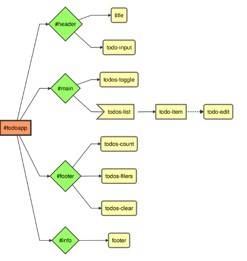

# Reagent TodoMVC Example

> Reagent provides a minimalistic interface between ClojureScript and React. It allows you to define efficient React components using nothing but plain ClojureScript functions and data, that describe your UI using a Hiccup-like syntax.

> _[Reagent - https://github.com/reagent-project/reagent](https://github.com/reagent-project/reagent)_

## Learning Reagent

The [Reagent website](http://reagent-project.github.io/) is a great resource for getting started.

Here are some links you may find helpful:

* [reagent-template](https://github.com/reagent-project/reagent-template)
* [reagent-cookbook](https://github.com/reagent-project/reagent-cookbook)
* [reagent-forms](https://github.com/reagent-project/reagent-forms)
* [yogthos blog](http://yogthos.net/)
* Twitter: [@ReagentProject](https://twitter.com/reagentproject)
* YouTube: [Reagent Project](https://www.youtube.com/channel/UC1UP5LiNNNf0a45dA9eDA0Q)

Get help from other reagent users:

* [Google Groups mailing list](https://groups.google.com/forum/#!forum/reagent-project)
* [SF Reagent Meetup](http://www.meetup.com/Reagent-Minimalistic-React-for-ClojureScript/)

## Components Summary

The following is a summary of the components directory.



## Running

Compile the clojurescript files.

```
$ lein cljsbuild once
```

*Note: to compile an optimized version, run `lein clean` followed by `lein with-profile prod cljsbuild once`*

Open `index.html` to view the example application.

## Credit

[Matthew Jaoudi](https://twitter.com/gadfly361), [Dmitri Sotnikov](https://twitter.com/yogthos), and [Dan Holmsand](https://twitter.com/holmsand)
