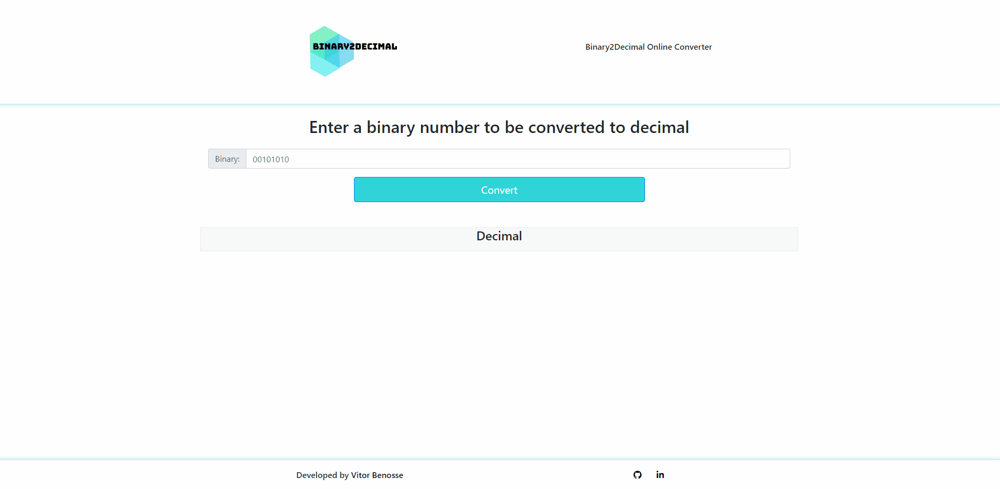

<h2 align="center">
Binary2Decimal - Conversor binário
</h2>

  

<h3 align="center">  
  <a href="#information_source-sobre">Sobre</a> |
  <a href="#interrobang-motivo">Motivo</a> | 
  <a href="#rocket-tecnologias-utilizadas">Tecnologias</a> |  
</h3>

## :information_source: Sobre

Binário é o sistema numérico em que todos os computadores digitais se baseiam. Por isso é importante que desenvolvedores entendam matemática binária ou base 2. O Binary2Decimal permite que o usuário insira sequências de até 8 dígitos binários, 0 e 1, em qualquer sequência e, em seguida, exibe seu equivalente decimal.

## :interrobang: Motivo

O objetivo do Binary2Decimal é fornecer prática e entendimento de como os cálculos binários funcionam.

## :rocket: Tecnologias Utilizadas

O projeto foi desenvolvido utilizando as seguintes tecnologias

- HTML
- CSS (framework Bootstrap)
- Javascript