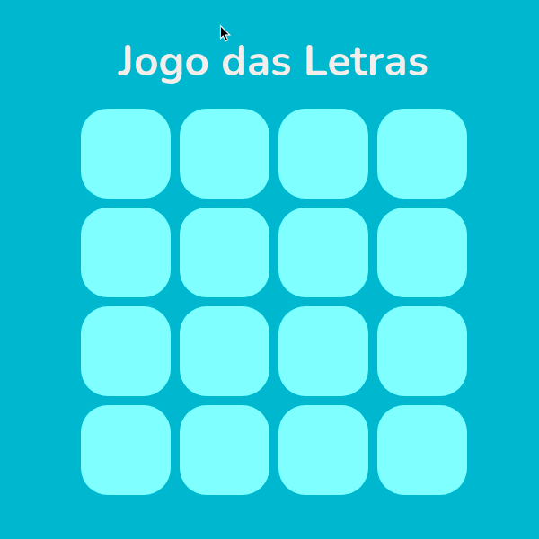

  

<h1 align="center">
  Words Game   <code>(Vanilla JS Version)</code>
</h1>

  Aprender as letras do alfabeto pode ser fácil 😉

## 🧠 Motivação

Jogos com Javascript mudaram minha jornada como desenvolvedor. Primeiro o [Simon Game](https://github.com/raphaeldevs/simon-game), depois o [Visual Memory](https://github.com/raphaeldevs/visual-memory) e agora este.

A inspiração surgiu quando vi meu irmão de 7 anos voltar da escola. A minha ideia era fazer um jogo onde ele pudesse ter contato com as letras e formar palavras, mesmo sem ainda saber ler totalmente.