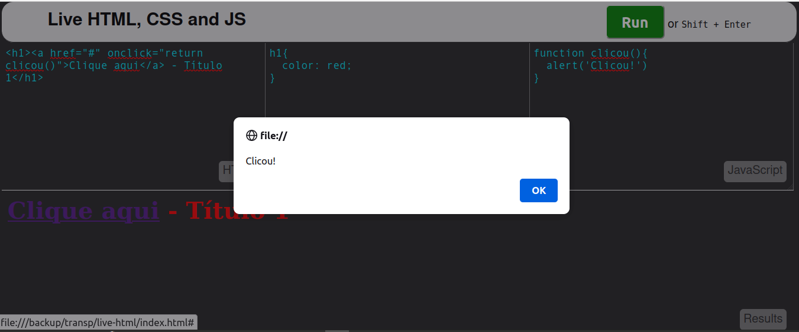

# HTML Live

## Com suporte a CSS e Javascript (e cia)

Um ótimo e simples editor que mostra o resultado do código que estamos criando ao vivo. Similar ao Codepen ou JSFiddle, mas que tanto pode ser usado no desktop ou na web.

## Fork
Este é um fork do projeto
https://github.com/sayhelloelijah/say-codeplayer
Quase sem alterações

## Exemplo
Veja um exemplo em que criei explorando as funcionalidades (HTML, CSS e JS):
- Na região HTML entrei
```
<h1><a href="#" onclick="return clicou()">Clique</a> - Título 1</h1>
```
- Na região CSS
```
h1{
  color: red;
}
```
Na região Javascript
```
function clicou(){
  alert('Clicou')
}
```
E clico em Run


